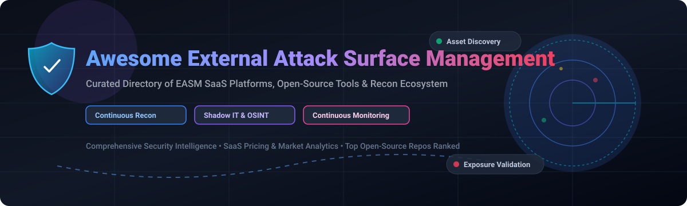

# Awesome External Attack Surface Management (EASM) 🛡️



<p align="center">
  <a href="https://github.com/ishandutta2007/Awesome-Awesome-Awesome"></a><a href="https://discord.gg/jc4xtF58Ve"></a>
  <a href="https://github.com/ishandutta2007/Awesome-External-Attack-Surface-Management"></a>
  <a href="https://github.com/ishandutta2007/Awesome-External-Attack-Surface-Management/network/members"></a>
  <a href="https://github.com/ishandutta2007/Awesome-External-Attack-Surface-Management/issues"></a>
  <a href="https://github.com/ishandutta2007/Awesome-External-Attack-Surface-Management/blob/main/LICENSE"></a>
  <a href="https://github.com/ishandutta2007"></a>
</p>

## 📌 Top External Attack Surface Management (EASM) Platforms & Recon Ecosystem

> **A Curated Directory of SaaS Products, Commercial Platforms & Open-Source Security Tools**  
> *Focused on Internet-Facing Asset Discovery, Shadow IT, Exposure Validation, Continuous Reconnaissance & Attack Surface Reduction.*

**Last updated:** September 2026

---

## 🔍 Overview & Market Intelligence

External Attack Surface Management (EASM) tracks and continuously monitors an organization’s internet-facing digital footprint (domains, IP ranges, public cloud resources, APIs, SSL/TLS certificates). EASM platforms identify unknown asset exposures, cloud sprawl, and shadow IT, continuously validating vulnerabilities before attackers exploit them.

### 📊 Market Size & Sector Fragmentation Analysis
The global External Attack Surface Management (EASM) market size is estimated at **$1.2 Billion in 2026** and is projected to reach **$3.8 Billion by 2030**, growing at a CAGR of ~30%. The sector is currently **moderately fragmented**: while large cybersecurity conglomerates (Palo Alto Networks, Microsoft, Tenable, Rapid7) dominate enterprise suites, specialized mid-market vendors (Censys, Detectify, UpGuard, IONIX, Assetnote) and hyper-focused open-source toolkits maintain significant market share. It is not yet a winner-take-all market.

---

## 📑 Table of Contents
- [🏢 SaaS & Hosted EASM Platforms](#-saas--hosted-easm-platforms)
- [🔓 Open-Source GitHub Projects](#-open-source-github-projects)
- [🤝 How to Contribute](#-how-to-contribute)
- [💖 Support & Sponsorship](#-support--sponsorship)
- [📈 Star History](#-star-history)
- [⚠️ Disclaimer](#%EF%B8%8F-disclaimer)

---

## 🏢 SaaS & Hosted EASM Platforms

The table below ranks major enterprise commercial SaaS platforms sorted by company scale (**Revenue / Valuation** descending).

| Platform | Description | Estimated Size (Revenue / Valuation) | Starting Pricing | Free Tier / Trial Limit |
| :--- | :--- | :--- | :--- | :--- |
| **[Microsoft Defender EASM](https://www.microsoft.com/)** | Enterprise attack surface discovery integrated into Azure and Microsoft Defender suite. | **$245B+ Revenue** ($3.1T Mkt Cap) | $0.01 per asset tracked / day (~$3.65/asset/yr) | 30-day free trial with up to 500 discovered assets |
| **[Palo Alto Cortex Xpanse](https://www.paloaltonetworks.com/)** | Enterprise-grade EASM platform with continuous automated internet-wide discovery and remediation. | **$8.0B+ Revenue** ($110B+ Mkt Cap) | $25,000 / year base package | 14-day enterprise proof-of-concept trial upon request |
| **[Tenable EASM](https://www.tenable.com/)** | Exposure management & attack surface solution following Tenable's acquisition of Bit Discovery. | **$850M+ Revenue** ($5B+ Mkt Cap) | $3,000 / year (starts at 65 asset units) | 30-day full feature free trial |
| **[Rapid7 Surface Command](https://www.rapid7.com/)** | Continuous external asset visibility and vulnerability exposure management engine. | **$820M+ Revenue** ($2.4B Mkt Cap) | $135 / month ($1,620/yr for core package) | 30-day free trial for up to 250 assets |
| **[Shodan Enterprise](https://www.shodan.io/)** | Global internet-connected device search engine and asset monitoring for enterprise exposures. | **$25M+ Revenue** (Private) | $69 / month (Freelancer tier) | Free basic account (100 query results/mo, 1 monitor IP) |
| **[Censys](https://censys.com/)** | Internet-wide scanning engine and attack surface analytics platform used by top security teams. | **$50M+ Revenue** ($500M Valuation) | $1,200 / year (Censys Search Pro) | Free Community Account (250 search queries/mo) |
| **[Detectify](https://detectify.com/)** | Web application and external attack surface scanner with continuous vulnerability tests. | **$30M+ Revenue** ($200M Valuation) | $50 / month (Starter Surface Monitoring) | 14-day full feature free trial (no credit card required) |
| **[UpGuard](https://www.upguard.com/)** | Attack surface management and third-party vendor risk assessment platform. | **$45M+ Revenue** ($180M Valuation) | $15,000 / year (Core Security Ratings & EASM) | 7-day instant domain security report & trial |
| **[CyCognito](https://www.cycognito.com/)** | Autonomous shadow IT discovery and exposure validation platform powered by AI. | **$40M+ Revenue** ($800M Valuation) | $18,000 / year entry tier | 14-day custom attack surface assessment trial |
| **[SOCRadar](https://socradar.io/)** | Extended Threat Intelligence (XTI) platform providing EASM, brand protection, and dark web monitoring. | **$20M+ Revenue** ($100M Valuation) | $249 / month (Basic Commercial Tier) | Free Forever Community Tier (up to 1 primary domain monitoring) |
| **[IONIX](https://www.ionix.io/)** | Continuous discovery and action-oriented attack surface reduction focusing on digital supply chain dependencies. | **$15M+ Revenue** ($100M+ Valuation) | $12,000 / year entry tier | 14-day exposure assessment trial |
| **[Hadrian](https://www.hadrian.io/)** | Autonomous continuous penetration testing and attack surface discovery platform. | **$10M+ Revenue** ($50M Valuation) | $15,000 / year entry tier | 14-day proof-of-value trial |
| **[Assetnote](https://www.assetnote.io/)** | High-fidelity asset discovery and continuous exposure detection platform used by security teams. | **$10M+ Revenue** ($45M Valuation) | $10,000 / year starting package | 14-day trial for verified enterprise security teams |

---

## 🔓 Open-Source GitHub Projects

Below is a ranked collection of top open-source tools for building self-hosted reconnaissance, subdomain enumeration, and attack surface discovery pipelines, sorted by **GitHub_Stars_Count** (descending).

| Project / Repository | Stars_Count | License | Description |
| :--- | :--- | :--- | :--- |
| **[Nmap](https://github.com/nmap/nmap)** | [](https://github.com/nmap/nmap/stargazers) | NPSL | The legendary network discovery, port scanner, and host audit utility. |
| **[Nuclei](https://github.com/projectdiscovery/nuclei)** | [](https://github.com/projectdiscovery/nuclei/stargazers) | MIT | Fast and customizable vulnerability scanner based on simple YAML templates. |
| **[Masscan](https://github.com/robertdavidgraham/masscan)** | [](https://github.com/robertdavidgraham/masscan/stargazers) | AGPL-3.0 | Asynchronous TCP port scanner capable of scanning the entire Internet in under 6 minutes. |
| **[theHarvester](https://github.com/laramies/theHarvester)** | [](https://github.com/laramies/theHarvester/stargazers) | GPL-3.0 | OSINT reconnaissance tool for gathering emails, subdomains, hosts, employee names, and open ports. |
| **[OWASP Amass](https://github.com/owasp-amass/amass)** | [](https://github.com/owasp-amass/amass/stargazers) | Apache-2.0 | Flagship open-source framework for in-depth attack surface mapping and asset discovery. |
| **[Subfinder](https://github.com/projectdiscovery/subfinder)** | [](https://github.com/projectdiscovery/subfinder/stargazers) | MIT | Fast passive subdomain discovery tool that harvests valid subdomains using passive online sources. |
| **[httpx](https://github.com/projectdiscovery/httpx)** | [](https://github.com/projectdiscovery/httpx/stargazers) | MIT | Multi-purpose HTTP toolkit allowing running of multiple probes with custom encoders and fingerprinters. |
| **[WhatWeb](https://github.com/urbanadventurer/WhatWeb)** | [](https://github.com/urbanadventurer/WhatWeb/stargazers) | GPL-3.0 | Next-generation web scanner identifying technologies, CMSs, blogging platforms, and embedded devices. |
| **[Naabu](https://github.com/projectdiscovery/naabu)** | [](https://github.com/projectdiscovery/naabu/stargazers) | MIT | Fast port scanner written in Go focused on reliability and simplicity for asset discovery pipelines. |
| **[gowitness](https://github.com/sensepost/gowitness)** | [](https://github.com/sensepost/gowitness/stargazers) | GPL-3.0 | Command-line web screenshot utility using Chrome Headless to visually audit web application attack surfaces. |
| **[dnsx](https://github.com/projectdiscovery/dnsx)** | [](https://github.com/projectdiscovery/dnsx/stargazers) | MIT | Fast and multi-purpose DNS toolkit for running multiple DNS queries and wildcard filtering. |
| **[Open Asset Model](https://github.com/owasp-amass/open-asset-model)** | [](https://github.com/owasp-amass/open-asset-model/stargazers) | Apache-2.0 | OWASP community specification for representing internet-facing assets and relationships uniformly. |

---

## 🏗️ Architecture for Self-Hosted EASM Pipelines

```
[ Seed Domains / ASNs ] 
       │
       ▼
[ Passive Subdomain Enumeration ] ──── (Subfinder, theHarvester, CT Logs)
       │
       ▼
[ DNS Resolution & Filtering ] ──────── (dnsx, Masscan, Naabu)
       │
       ▼
[ Probing & Tech Fingerprinting ] ──── (httpx, WhatWeb, gowitness)
       │
       ▼
[ Exposure Scanning & Diffing ] ────── (Nuclei + Open Asset Model DB)
```

---

## 🤝 How to Contribute

Contributions are very welcome! To submit a new SaaS platform or open-source tool:
1. Fork this repository.
2. Add your entry in `README.md` keeping formatting, tables, and sorting consistent.
3. Open a Pull Request with a short summary of changes.

---

## 💖 Support & Sponsorship

If you find this repository helpful for your security research, attack surface management projects, or OSINT work, please consider supporting the project:

- 🌟 **Star** this repository on GitHub
- 🔀 **Fork** and share it with your security team & colleagues
- ☕ **Buy me a coffee**: Support ongoing open-source maintenance via [GitHub Sponsors](https://github.com/sponsors/ishandutta2007)

Thank you to all community contributors! 🙏

---

## 📈 Star History

[](https://star-history.dera.page/#ishandutta2007/Awesome-External-Attack-Surface-Management&type=date&legend=top-left)

---

## ⚠️ Disclaimer

- This list is **community-curated** for educational, security research, and defensive purposes only.
- External attack surface discovery and port scanning must only be performed on domains and networks you own or have explicit written authorization to test.
- The author accepts no liability for misuse of tools listed in this repository.

---

**Maintained with ❤️ by security engineers, ASM practitioners, and open-source advocates.**
